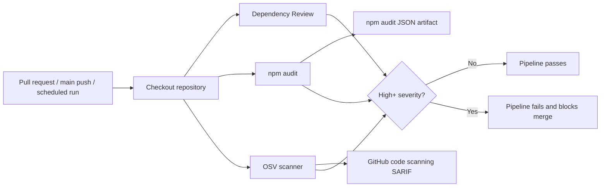

# Dependency Vulnerability Scanning Pipeline

## Overview

VeriNode runs automated dependency vulnerability checks for every pull request, every push to `main`, and a daily scheduled scan. The pipeline combines three complementary controls:

1. **Dependency Review** blocks pull requests that introduce high or critical vulnerabilities or denied copyleft licenses.
2. **npm audit** validates the resolved Node.js dependency tree from `package-lock.json` and publishes a JSON report artifact.
3. **OSV Scanner** checks the lockfile against the Open Source Vulnerabilities database and uploads SARIF results to GitHub code scanning.

The pipeline is intentionally isolated from runtime code paths. It does not add client-side JavaScript, network calls, or production middleware, so it has no impact on the application's < 100ms P99 critical-path target or availability objective.

## Architecture



## Policy

- Pull requests fail when a dependency change introduces a vulnerability with **high** or **critical** severity.
- Pull requests fail when dependency review detects `GPL-2.0`, `GPL-3.0`, `AGPL-1.0`, or `AGPL-3.0` licenses.
- Scheduled scans run daily at 03:17 UTC to catch newly disclosed CVEs in dependencies that have not changed recently.
- Security reports are retained as workflow artifacts for 30 days.

## Local usage

Run the same npm audit gate locally before requesting review:

```bash
npm run security:audit
```

The command writes `reports/security/npm-audit.json` and exits non-zero if high or critical vulnerabilities are present.

## Monitoring and alerting

- GitHub Actions job failures are the primary alert and should be routed through repository notification settings.
- OSV SARIF uploads populate GitHub code scanning alerts for triage and historical tracking.
- The scheduled workflow provides continuous monitoring even when no code is being merged.

## Deployment and rollout

This change is a CI-only rollout. It does not deploy application code and therefore does not require blue-green production traffic switching. The equivalent safe rollout is:

1. Enable on pull requests first so failures are visible before merge.
2. Keep scans isolated in independent jobs to avoid reducing application availability.
3. Require the workflow as a branch protection check after the first successful run on `main`.
4. Use scheduled scans as the canary signal for newly disclosed vulnerabilities.

## Runbook

1. Open the failed GitHub Actions run and inspect the failing dependency scan job.
2. Download the relevant artifact (`npm-audit-report` or `osv-results`) or inspect GitHub code scanning.
3. Prefer upgrading the vulnerable direct dependency. If the issue is transitive, upgrade the nearest direct dependency or apply an npm `overrides` entry with a link to the advisory.
4. Re-run `npm ci`, `npm run security:audit`, `npm run lint`, and `npm run build` locally.
5. Document any accepted risk in the pull request, including severity, exploitability, compensating controls, and a follow-up issue.
6. Do not bypass a high or critical finding without security-owner approval.
